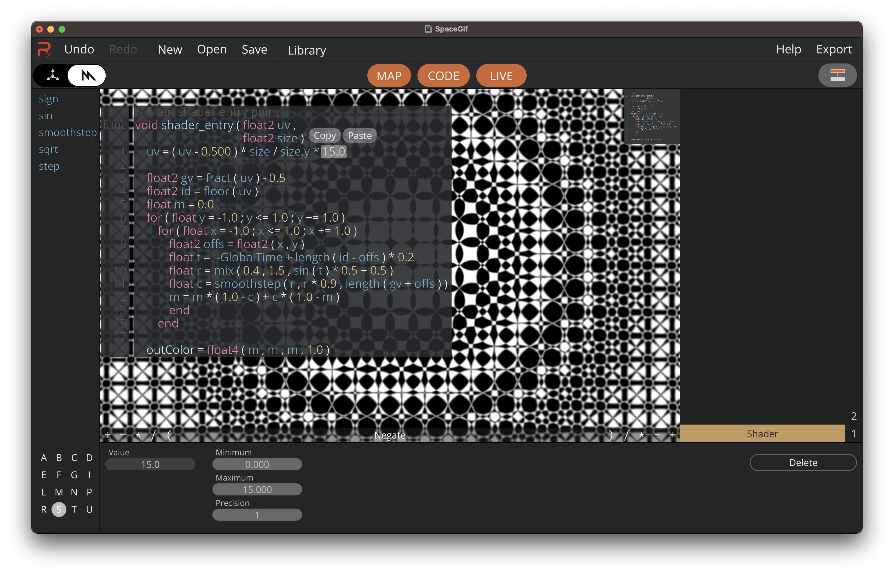

## A Visual Metal Shader Editor for macOS and iPadOS

Render-Z allows you to visually create Metal shaders. Drag and drop function calls, variables and change them on the fly.

## Workflow for Artists and Developers

Developers can expose shader variables to artists.