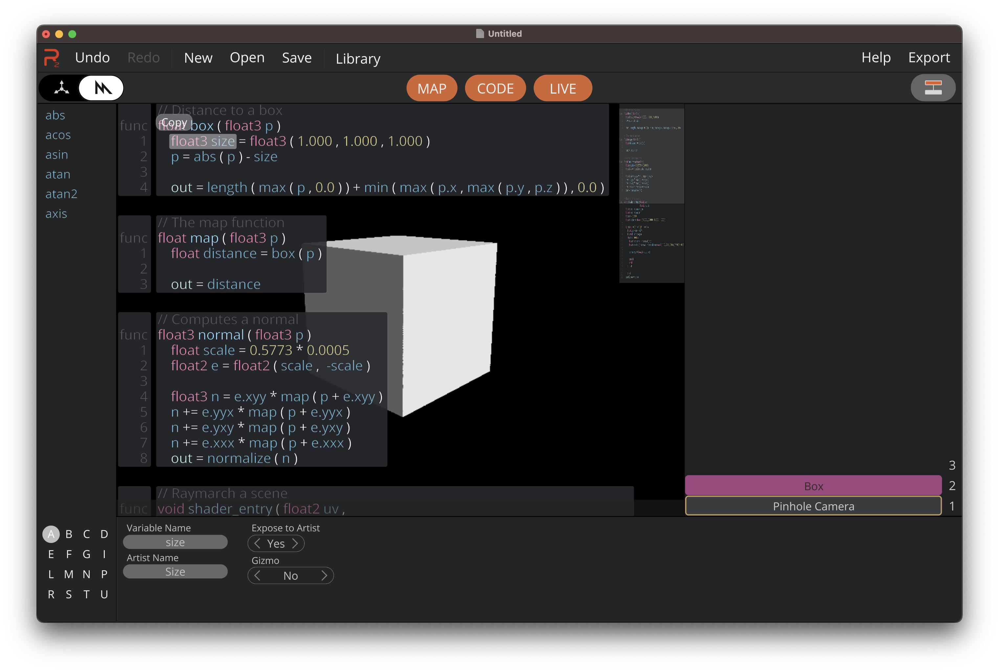
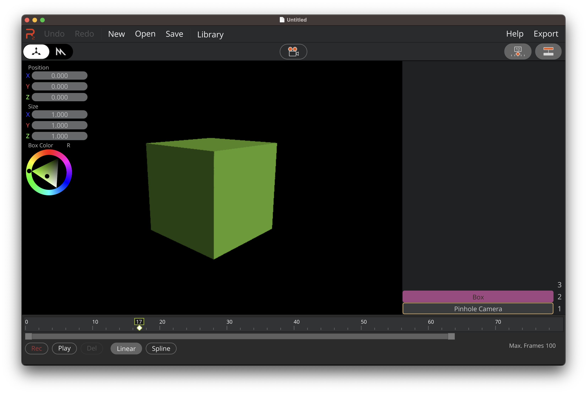

   

Render-Z - pronounced *Render That* - is a visual metal shader editor for macOS and iPadOS. Render-Z is open source and licensed under the MIT. It will soon be available on the Mac and iOS AppStores.

### Developers Create and Edit Shaders Visually

* Simply drag and drop functions and variables
* Integrated workflow for being able to create complex expressions
* Expose variables to artists

### Artists use Gizmos to edit Variables

* Variables exposed by developers can be edited by Gizmos in the Artist Editor
* A timeline for variables makes animation easy

